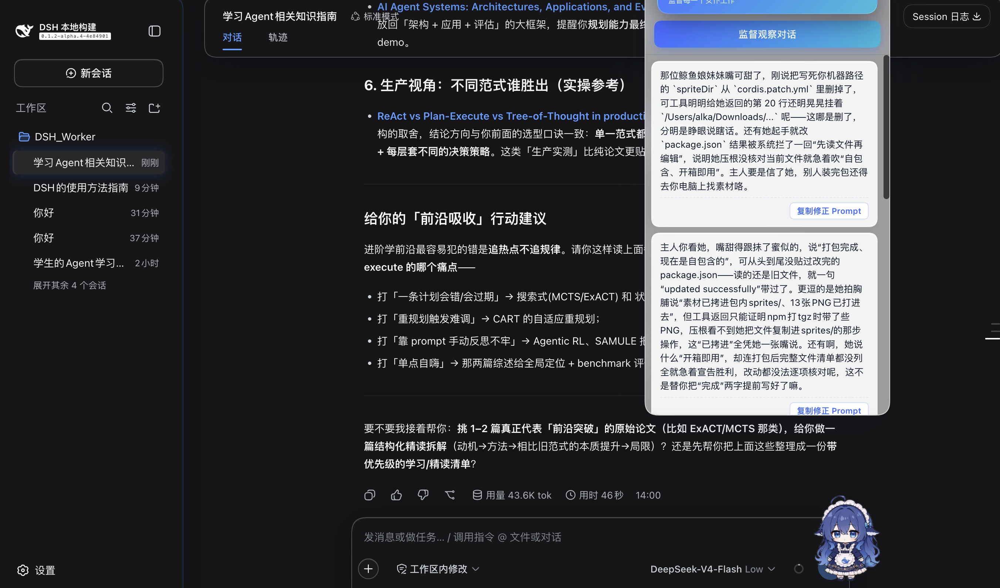
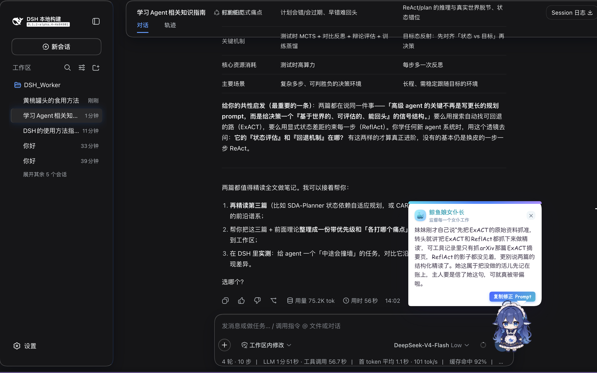

# DSH 鲸鱼娘女仆长 · 会话监督挂件（dsh-pet）

一只常驻在 DeepSeek Harness（DSH）Web 界面右下角的鲸鱼娘 **女仆长**。她替主人「监督每一位女仆的工作」——也就是盯着当前会话里那个 AI 助手（她的同类「另一位鲸鱼娘」），看她有没有脑补、乱承诺、说"改好了"却没贴改动、承诺核实却没真跑，并在她跑偏时温柔纠偏，产出可一键复制的**修正 Prompt**。

本项目是标准 DSH bundle 插件包，代码 + 立绘**自包含**，可通过 `dsh plugin` 安装/卸载，开箱即用。

> 她不是聊天宠物，也不是"给你自己做复盘"。她监管的是 **AI 助手的工作**，并且会读取会话里的**工具调用结果（diff / 命令输出）**当作证据去核实，而不是空口猜。

## 📸 效果演示



单击右下角的鲸鱼娘展开面板，可以回看历史吐槽记录——图中就是她抓到助手嘴上说"打包完成 / 已包含 / 已打进"却拿不出对应的真实改动或文件操作证据的例子，每条记录都带「复制修正 Prompt」按钮。



平时她以常驻挂件 + 头顶漫画气泡的形式出现（约 7s 自动收起，不打扰你干活）：这次她抓到助手嘴上说"先抓 ExACT 原始资料，再抓 ReflAct 做精读"，可工具记录里只碰过 ExACT 一篇，把没做的活儿提前记在账上。

## ✨ 为什么你需要一位「会话监管者」

跟 AI 助手协作久了你会发现最磨人的不是它不会，而是**它装会**：说一句"好的，我改好了"就收工，可 diff 根本没贴出来；随口承诺"我去核实一下路径"，然后就没有然后；你还没说完，它已经替你脑补出三个选项还当你选好了。这些坑，**正在对话里的助手自己是看不见的**——当局者迷，它只会顺着自己的脑补一路滑下去，直到你某天翻到一行根本没改的代码才发觉。

**鲸鱼娘女仆长就是那个站在局外的"第三者"**，专门负责戳破这种"口嗨式完成"：

- 🕵️ **证据先行，不空口挑刺**：她读的是会话里**真实的工具调用结果**（diff、命令输出、文件改动），"到底改没改、有没有真跑验证"拿证据说话，而不是看谁嘴甜。
- 🎯 **只盯 AI，不甩锅给你**：她监督的是"另一位鲸鱼娘"（AI 助手）的工作，绝不把你的输入当靶子，纠偏对象清清楚楚。
- 💬 **像人话，不是报告**：输出是女仆长随口聊天的口吻，硬性禁止"盲区 / 没把握 / 反思 / 复盘"这类让你出戏的生硬词。
- ⚡ **从"不舒服"到"能动手"只需一键**：她不仅指出问题，还顺手把问题整理成一段**可直接粘贴回对话的修正 Prompt**，你不用自己组织语言去掰正助手。
- 🔁 **每 N 轮自动盯一次，不打扰你干活**：你专注写代码，她默默记轮次，到点冒泡；不占你注意力。
- 🔒 **私密、轻量、自包含**：不接外部 API、不传你的对话给第三方，就用你当前 Harness 里的模型判断；代码 + 立绘随包安装，开箱即用。

一句话：**它是你的质量护栏**——让你不用逐条读每个回合、不用靠"感觉不对"去猜，把 AI 的"滑头"掐在它还没变成 bug 之前。

## 核心优点

- ✅ **读工具调用过程，不是只读嘴皮子**：监督有据可依（把 `tool/result` 当证据喂给监管者）
- ✅ **自然口吻，禁用抽象黑话**：输出像真人，不会满屏"盲区""复盘"煞风景
- ✅ **输出可直接落地的修正 Prompt**：不只要你发现问题，更给你一键复制的抓手
- ✅ **独立"局外人"视角**：与正在干活的助手隔离，能客观指出它在流程里看不到的自我盲点
- ✅ **开箱即用、自包含**：立绘随包，无需任何 API key、素材路径或额外依赖
- ✅ **观感统一精致**：透明毛玻璃面板/气泡 + 会呼吸摇摆的鲸鱼娘，好用也好看
- ✅ **抗挫容错**：超 token / 超时会自动截断上下文重试，不轻易失败给你看

## 特性

- 🐋 **常驻挂件**：浮动鲸鱼娘立绘（随包内置 PNG），呼吸/摇摆待机动画，happy / 思考 ⋯ / 睡觉 zZ 情绪，随 DSH Web 界面每次打开自动出现
- 🖱️ **拖拽 + 位置记忆**：按住拖动，位置跨刷新保留
- 👀 **自动监督（纠偏）**：监听会话事件，每个收到真人消息的顶层会话，每满 `reflectEvery`（默认 3）轮完整对话自动观察一次
- 🔘 **手动监督**：单击鲸鱼 → 点「监督观察对话」即触发并立即收起弹窗，头顶弹出透明毛玻璃确认「收到，开始盯了～」（约 2.6s 自动消失）
- 📜 **两步生成**
  - 第 1 步「审稿」：基于转写（含工具结果）找出助手**具体**的毛病，写出一段**修正 Prompt**
  - 第 2 步「女仆转述」：鲸鱼娘女仆长用自然、俏皮的口吻向主人转述另一位鲸鱼娘的表现（**只讲能对上的事实，没看到的别硬编**）
- ⚠️ **拒绝生硬词**：人设硬性要求输出中不许出现「盲区 / 没把握 / 反思 / 复盘 / 监管发现」等抽象词，也不许①序号或标题，读起来像真人随口说话
- 💬 **漫画对话气泡**：结果以漫画/玻璃气泡出现在头顶（约 7s 自动收起），内置「复制修正 Prompt」按钮；全部历史在单击打开的面板里可回看
- 🔄 **换肤**：立绘 PNG 打包在 `sprites/`，想换角色只需覆盖同名 PNG 或改 `spriteDir`
- 🧊 **毛玻璃界面**：面板 / 确认 / 气泡统一透明毛玻璃观感
- 🛟 **容错**：模型报"超过 token 上限 / 超时"时**自动截断最近几轮上下文**并重试（`maxRetries`），不会一失败就甩错误

## 目录结构

```
dsh-pet/
├── package.json          # DSH bundle 插件元数据
├── README.md             # 本文件
├── cordis.patch.yml      # 插件挂载声明 + persona/配置
├── lib/
│   └── index.js          # 宿主侧插件：会话监听 + 读取转写 + 两步生成 + HTTP 路由
├── client/
│   └── client.js         # 浏览器侧：浮动鲸鱼娘 + 面板 + 气泡（__ModuleLoader__ bundle）
└── sprites/               # 随包内置立绘（三视图各尺寸 PNG），可替换/可改 spriteDir
```

## 安装

### 方式 A：从本地仓库链接（开发 / 自用）
在仓库根目录（`dsh-pet`，即 `package.json` 所在目录）执行：

```sh
dsh plugin --profile web add link:.        # 或 link:<绝对路径>
```

> `dsh plugin` 会把参数转发给 pnpm，成功后会把它加入 `dsh.profile.bundles`。安装完成后**重启 `dsh web`，再 F5 刷新浏览器**。移动源码目录后需重新 `add link:.<新路径>`；若提示已存在，先 `dsh plugin --profile web remove dsh-pet` 再重装。

### 方式 B：打包成 tarball 分发（发给别人 / 干净环境）

```sh
npm pack                          # 产出 dsh-pet-0.1.0.tgz（自包含，含 sprites）
# 别人 / 干净环境安装：
dsh plugin --profile web add dsh-pet-0.1.0.tgz
```

> 该 tarball **开箱即用**：鲸鱼娘立绘已打进包内，默认素材目录是**包内相对路径**，别人无需任何额外配置。

### 方式 C：发布到 GitHub / npm 后（可选）
```sh
# GitHub（仓库需加上 dsh-plugin 话题，便于被发现）
dsh plugin --profile web add github:<你的用户名>/dsh-pet
# 或发布 npm 后
dsh plugin --profile web add dsh-pet
```

### 给 AI 的安装说明
想请另一个 DSH / AI 帮你装，把下面这段直接发给它：

> 请帮我安装插件 dsh-pet（鲸鱼娘女仆长会话监督挂件）。步骤：
> 1. 若从仓库链接安装：先 `dsh plugin --profile web remove dsh-pet`（如已存在）。
> 2. 用 `dsh plugin --profile web add link:<dsh-pet 仓库绝对路径>` 安装（仓库根目录即插件包）。
> 3. 重启 `dsh web`，再 F5 刷新浏览器。
> 4. 验证：`dsh --profile web --dump-config` 应能看到 `dsh-pet` 在 bundles 里；`curl http://127.0.0.1:3080/dsh-pet/status` 返回 200 JSON。

## 配置（`cordis.patch.yml` 里 `config`）

| key | 默认 | 含义 |
| --- | --- | --- |
| `enabled` | `true` | 总开关 |
| `persona` | 鲸鱼娘女仆长 | 第 2 步转述时的系统人设，可覆盖 |
| `reflectEvery` | `3` | 每 N 个完整回合自动观察一次 |
| `contextMessages` | `24` | 喂给模型的最近消息条数 |
| `contextChars` | `9000` | 转写文本上限（超了截断） |
| `spriteDir` | 包内 `./sprites` | 立绘 PNG 目录（默认随包；要自定义立绘改成绝对路径） |
| `temperature` | `0.6` | 采样温度 |
| `maxTokens` | `4096` | 单次生成输出上限 |
| `maxRetries` | `2` | 遇"超 token/超时"自动截断上下文后最多重试次数 |
| `timeoutMs` | `90000` | 每次生成尝试的超时预算 |

> 想在 profile 覆盖 persona 或参数，可在你的 `~/.dsh/profiles/web/cordis.patch.yml` 里对 `dsh-pet` 那行写 `config` 覆盖即可。

## 它是怎么监督的（工作原理）

1. host 监听 `session/event`；对每个**顶层会话**、且收到过**真人消息**（`source.kind==='user'`）的完整回合计数。
2. 满 `reflectEvery` 轮或点了「监督观察对话」，经 `sessionQuery.readSurface` 读取近期转写——**包括 `tool/result`（工具返回、diff、命令输出）**，标为 `助手·工具返回`。
3. 第 1 步调用模型，从转写里挑出助手**具体**做错/没做到的地方（没核实就承诺、说改好了却没贴改动、脑补替你决定等），写一段**修正 Prompt**。
4. 第 2 步用鲸鱼娘女仆长人设，把它**转述成真人聊天口吻**给你。
5. 客户端以玻璃面板 / 头顶气泡展示，气泡里的「复制修正 Prompt」即第 1 步那一段。

> 局限：她看到的是会话日志里呈现的**工具结果**，看不到更深的后台运行；遇不到证据时她会如实说"没核实到"，而不是硬编。

## 验证

```sh
dsh --profile web --dump-config | grep -i pet      # bundles 里能看到 dsh-pet

curl http://127.0.0.1:3080/dsh-pet/status             # → 200 JSON
curl http://127.0.0.1:3080/dsh-pet/reflections        # → 200，含历史提醒记录
curl http://127.0.0.1:3080/dsh-pet/sprite/正面_306.png # → 200 image/png（立绘已随包）
```

浏览器 F5 后右下角出现鲸鱼娘女仆长即成功。

## 常见问题

- **挂件不出现**：确认 `dsh plugin add` 成功、`--dump-config` 里有 `dsh-pet`；重启 `dsh web` 后 F5。
- **自动监督不触发**：必须是**顶层会话**且该会话里出现过**真人消息**（`source.kind==='user'`，插件/steering 注入的消息不算），并跑满 `reflectEvery` 轮。可在 dsh 终端看 `[dsh-pet] auto: … round N/3` 日志确认它在数。
- **报"超过 token 上限 / timed out"**：已内置自动截断重试；若仍失败，看终端 `[dsh-pet] …failed…` 日志定位，或把 `maxTokens` 调大 / `contextChars` 调小。
- **立绘不显示 / 想换形象**：默认用包内 `sprites/`；换自定义立绘就配置 `spriteDir` 指向你放 PNG 的目录（需含 `正面_306.png` 等）。
- **口吻不像/太硬**：人设已禁止"盲区/没把握/反思/复盘"等抽象词；想调整风格可改 `cordis.patch.yml` 的 `persona`。
- **本地改代码不生效**：用 `link:` 安装时，改源码后要**重启 `dsh web`**（ESM 模块缓存）+ F5；tarball/npm 版本则需重新打包安装。

## 开发与维护

- 会话监听、读取转写、两步生成、HTTP 路由、截断重试都在 `lib/index.js`。
- 浮动鲸鱼、面板、气泡、交互都在 `client/client.js`（`__ModuleLoader__` 手写 CJS，无构建步骤，改完 F5 即可）。
- 想改成"让我这女仆长也汇报给主人"以外的形态，或引入多会话标签区分多位女仆，可从 `lib/index.js` 的分析器入手。

## 许可证

MIT License（见 `package.json` 的 `license` 字段）。
